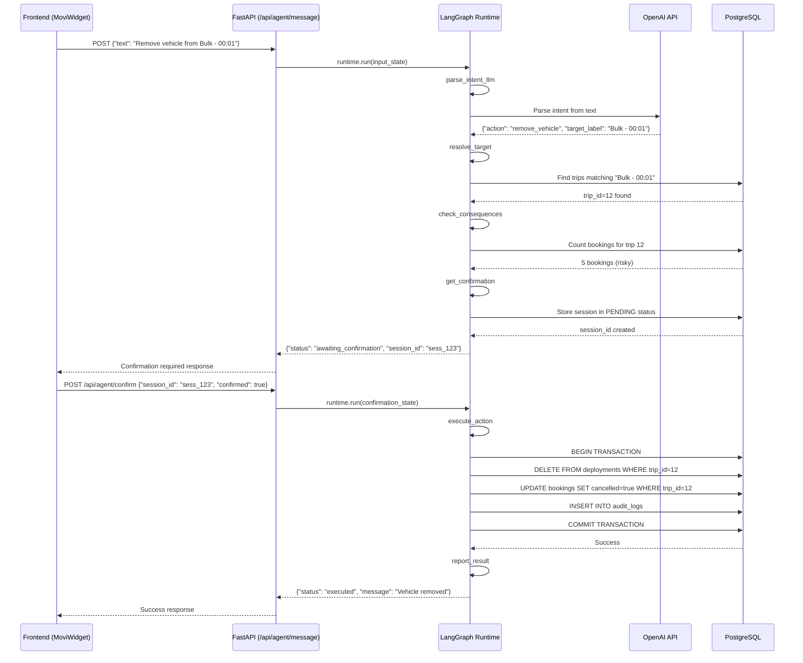
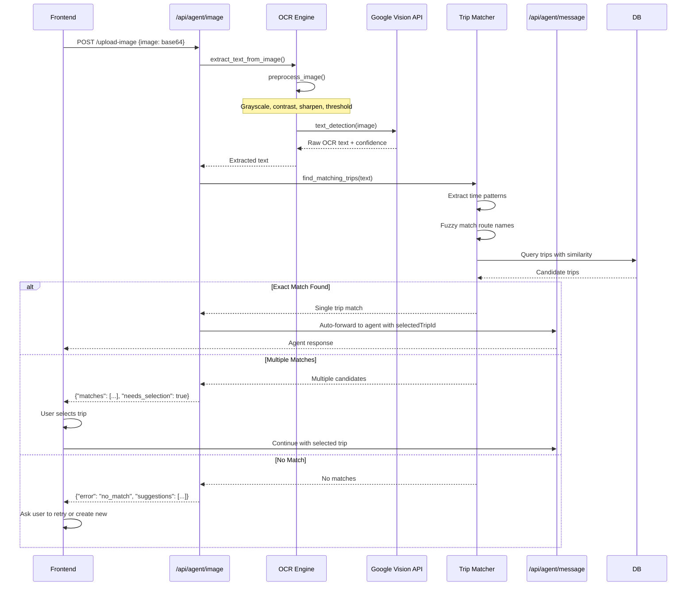
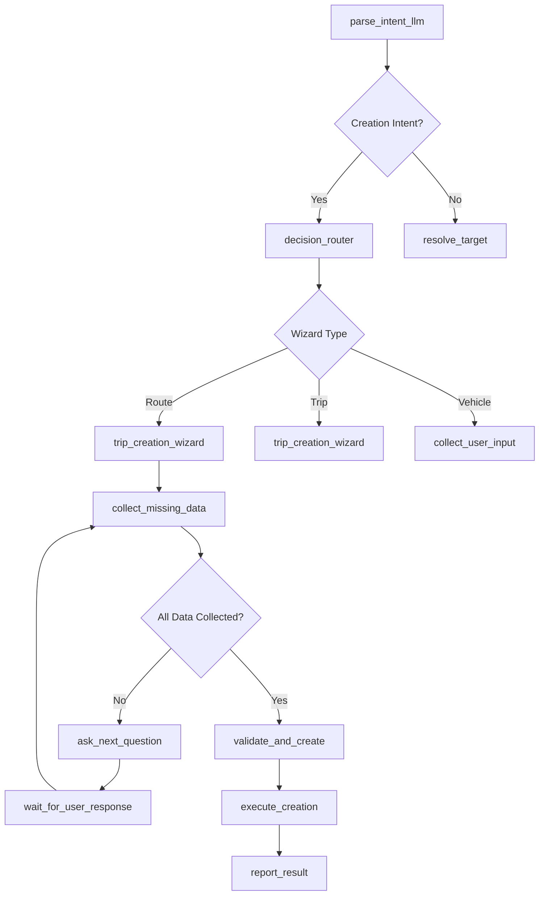

# MOVI Backend Architecture Deep Dive — How Everything Works Under the Hood

## Table of Contents
1. [High-Level Backend Architecture](#1-high-level-backend-architecture)
2. [Full Request Lifecycle](#2-full-request-lifecycle)
3. [Deep Dive Into LangGraph](#3-deep-dive-into-langgraph)
4. [Database Layer Analysis](#4-database-layer-analysis)
5. [LLM Integration Deep Dive](#5-llm-integration-deep-dive)
6. [OCR Pipeline Internal Mechanics](#6-ocr-pipeline-internal-mechanics)
7. [Conversational Creation Agent](#7-conversational-creation-agent)
8. [Error Handling & Fallback System](#8-error-handling--fallback-system)
9. [Example Execution Traces](#9-example-execution-traces)
10. [Final Summary](#10-final-summary)

---

## 1. High-Level Backend Architecture

### 1.1 Overview
MOVI's backend is a sophisticated multi-layered architecture that combines FastAPI for HTTP transport, LangGraph for AI orchestration, PostgreSQL for persistence, and external APIs for OCR and LLM capabilities.

```mermaid
graph TB
    subgraph "Transport Layer"
        A[FastAPI Application]
        B[CORS Middleware]
        C[Custom Middleware]
    end
    
    subgraph "API Router Layer"
        D[/api/agent - LangGraph]
        E[/api/agent/image - OCR]
        F[/api/routes - CRUD]
        G[/api/actions - Business]
        H[/api/context - UI State]
    end
    
    subgraph "Agent Runtime Layer"
        I[LangGraph Runtime]
        J[Graph Definition]
        K[Node Execution]
        L[State Management]
    end
    
    subgraph "Service Layer"
        M[Business Logic]
        N[Transaction Management]
        O[Validation Logic]
        P[Audit Logging]
    end
    
    subgraph "Data Access Layer"
        Q[Supabase Client]
        R[Connection Pool]
        S[AsyncPG Driver]
        T[PostgreSQL DB]
    end
    
    subgraph "External Services"
        U[OpenAI API - LLM]
        V[Google Vision - OCR]
        W[Gemini API - Fallback]
    end
    
    A --> D
    A --> E  
    A --> F
    D --> I
    I --> J
    J --> K
    K --> M
    M --> Q
    Q --> S
    S --> T
    K --> U
    E --> V
```

### 1.2 Core Components

#### FastAPI Transport Layer
- **Main Application**: `app/main.py` - Entry point with lifespan management
- **Middleware Stack**: CORS, custom auth, error handling
- **Auto-Documentation**: OpenAPI/Swagger at `/docs`
- **Health Checks**: Database connectivity monitoring

#### Router Design
The API follows a modular router pattern:

```python
# Main routers registration
app.include_router(routes.router, prefix="/api/routes", tags=["Routes & Entities"])
app.include_router(actions.router, prefix="/api/actions", tags=["Trip Actions"]) 
app.include_router(agent.router, prefix="/api/agent", tags=["AI Agent"])
app.include_router(agent_image.router, prefix="/api", tags=["AI Agent - Image"])
app.include_router(context.router, prefix="/api/context", tags=["UI Context"])
```

**Router Responsibilities:**
- `agent.py`: LangGraph execution endpoints (`/message`, `/confirm`)
- `agent_image.py`: OCR processing and image-to-text flow
- `routes.py`: Entity CRUD (trips, vehicles, drivers, routes)
- `actions.py`: Business actions (assign/remove vehicle, cancel trip)
- `context.py`: UI state management and data fetching

#### Database Layer (Supabase + AsyncPG)
- **Connection Pooling**: Initialized on startup with `init_db_pool(min_size=2, max_size=10)`
- **Transaction Safety**: All business operations wrapped in transactions
- **Audit Trail**: Every mutation logged to `audit_logs` table
- **Row-Level Security**: Supabase RLS for data isolation

#### LangGraph Agent Runtime
- **Graph Definition**: Declarative node/edge structure in `graph_def.py`
- **Runtime Executor**: State machine execution in `runtime.py`
- **Tool Integration**: Database operations wrapped as LangGraph tools
- **Session Management**: Persistent state across multi-turn conversations

#### OCR Processing Pipeline
- **Preprocessing**: PIL-based image enhancement (grayscale, contrast, sharpening)
- **Text Extraction**: Google Cloud Vision API integration
- **Fuzzy Matching**: Trip identification from extracted text
- **Context Integration**: Seamless flow into LangGraph agent

### 1.3 Session Store & State Management

#### Agent Sessions Table
```sql
CREATE TABLE agent_sessions (
    session_id TEXT PRIMARY KEY,
    status TEXT NOT NULL CHECK (status IN ('PENDING', 'CONFIRMED', 'DONE')),
    pending_action JSONB,
    user_id INTEGER,
    created_at TIMESTAMP DEFAULT NOW(),
    updated_at TIMESTAMP DEFAULT NOW()
);
```

**Session Lifecycle:**
1. **PENDING**: User action requires confirmation, state stored in `pending_action`
2. **CONFIRMED**: User confirmed via `/api/agent/confirm`, ready for execution
3. **DONE**: Action executed successfully, session can be cleaned up

#### State Schema
```python
{
    "text": "Remove vehicle from Bulk - 00:01",
    "action": "remove_vehicle", 
    "trip_id": 12,
    "target_label": "Bulk - 00:01",
    "consequences": {"booking_count": 5, "capacity_percentage": 25},
    "session_id": "sess_abc123",
    "status": "awaiting_confirmation",
    "needs_confirmation": true,
    "wizard_active": false,
    "from_image": false
}
```

---

## 2. Full Request Lifecycle

### 2.1 Text Message Flow

**Endpoint**: `POST /api/agent/message`



**Detailed Step Breakdown:**

1. **API Entry** (`agent.py:@router.post("/message")`):
   - Validates `AgentMessageRequest` model
   - Checks for existing wizard sessions
   - Prepares `input_state` with user context

2. **Runtime Execution** (`runtime.py:GraphRuntime.run()`):
   - Starts at "parse_intent" node
   - Iterates through nodes until terminal state
   - Maximum 20 iterations to prevent infinite loops

3. **Parse Intent** (`nodes/parse_intent_llm.py`):
   - Calls OpenAI API with structured prompt
   - Extracts action type, target label, confidence
   - Handles ambiguous input with clarification requests

4. **Resolve Target** (`nodes/resolve_target.py`):
   - Queries database to find matching trips/routes
   - Uses fuzzy string matching for partial matches
   - Validates trip existence and user permissions

5. **Check Consequences** (`nodes/check_consequences.py`):
   - Calls `get_trip_consequences()` from service layer
   - Checks booking counts, capacity percentages
   - Determines if user confirmation required

6. **Get Confirmation** (`nodes/get_confirmation.py`):
   - Creates session record in database
   - Stores pending action as JSONB
   - Returns session_id to frontend

7. **Execute Action** (`nodes/execute_action.py`):
   - Maps action to service layer function
   - Wraps in database transaction
   - Records audit log entry

8. **Report Result** (`nodes/report_result.py`):
   - Formats success/error message
   - Cleans up session state
   - Returns final response

### 2.2 Image Upload Flow

**Endpoint**: `POST /api/agent/image`



**OCR Processing Details:**

1. **Image Preprocessing** (`core/ocr.py:preprocess_image()`):
   ```python
   # Resize if too large (max 2000px)
   max_dimension = 2000
   if max(image.size) > max_dimension:
       ratio = max_dimension / max(image.size)
       new_size = tuple(int(dim * ratio) for dim in image.size)
       image = image.resize(new_size, Image.Resampling.LANCZOS)
   
   # Convert to grayscale
   image = image.convert('L')
   
   # Enhance contrast
   enhancer = ImageEnhance.Contrast(image)
   image = enhancer.enhance(2.0)
   
   # Apply sharpening filter
   image = image.filter(ImageFilter.SHARPEN)
   
   # Binary threshold
   threshold = 128
   image = image.point(lambda x: 255 if x > threshold else 0)
   ```

2. **Google Vision API Call**:
   - Sends preprocessed image to Cloud Vision
   - Receives text annotations with bounding boxes
   - Calculates average confidence score

3. **Trip Matching** (`core/trip_matcher.py`):
   ```python
   # Extract time patterns
   time_matches = re.findall(r'\b\d{1,2}:\d{2}\b', text)
   
   # Fuzzy match route names
   for route in routes:
       similarity = fuzz.partial_ratio(route['name'].lower(), text.lower())
       if similarity > threshold:
           candidates.append(route)
   
   # Query database for trip combinations
   query = """
   SELECT dt.trip_id, dt.trip_date, r.name as route_name, dt.departure_time
   FROM daily_trips dt 
   JOIN routes r ON dt.route_id = r.route_id
   WHERE similarity(r.name, %s) > 0.3
   ORDER BY similarity(r.name, %s) DESC
   """
   ```

### 2.3 Conversational Creation Wizard

**Trigger**: User input contains creation intent (e.g., "Create a new route")



**Multi-Turn State Management:**

Session state preserves wizard progress:
```python
{
    "wizard_active": True,
    "wizard_type": "route_creation",
    "wizard_step": 3,
    "wizard_data": {
        "route_name": "New Express Route",
        "stops": [
            {"name": "Downtown Station", "latitude": 40.7128, "longitude": -74.0060},
            {"name": "Airport Terminal", "latitude": 40.6892, "longitude": -74.1745}
        ],
        "missing_fields": ["operating_hours", "fare_price"]
    }
}
```

**Step-by-Step Flow:**
1. **Intent Recognition**: LLM identifies creation request
2. **Router Decision**: `decision_router` selects appropriate wizard
3. **Data Collection**: Multi-turn conversation to gather required fields
4. **Validation**: Business rules validation before creation
5. **Database Creation**: Transactional entity creation
6. **Confirmation**: Success message with created entity details

---

This concludes Part 1 of the deep-dive documentation. The next parts will cover the remaining sections including the detailed LangGraph analysis, database layer deep dive, and execution traces. 

**Continue to Part 2?** (React with 👍 to continue with sections 3-5)
