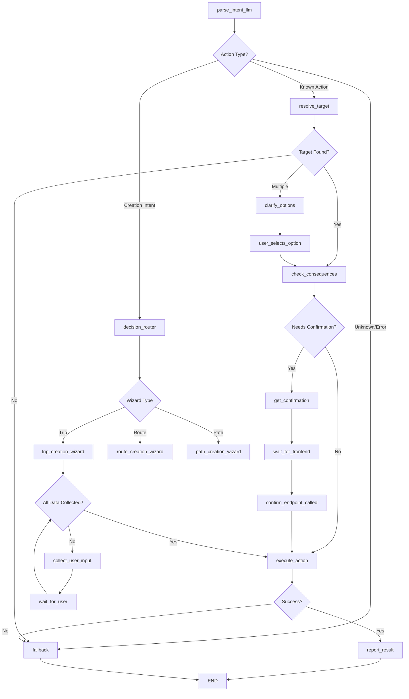

# MOVI Backend Architecture Deep Dive — Part 2: LangGraph, Database & LLM

## 3. Deep Dive Into LangGraph

### 3.1 Agent State Schema

The agent state is the core data structure that flows through all nodes in the LangGraph execution. Here's the complete schema:

```python
class AgentState(TypedDict):
    # === INPUT FIELDS ===
    text: str                    # Original user input
    user_id: int                 # User performing the action  
    session_id: Optional[str]    # Session identifier for multi-turn
    currentPage: Optional[str]   # UI context (e.g., "TripDetailPage")
    selectedTripId: Optional[int] # OCR-resolved trip ID
    selectedRouteId: Optional[int] # UI-selected route ID
    from_image: Optional[bool]   # Flag indicating OCR input source
    
    # === LLM PARSING RESULTS ===
    action: str                  # Parsed action type (cancel_trip, remove_vehicle, etc.)
    target_label: Optional[str]  # LLM-extracted entity name
    target_time: Optional[str]   # Extracted time (HH:MM format)
    target_trip_id: Optional[int] # LLM-extracted trip ID
    target_path_id: Optional[int] # LLM-extracted path ID  
    target_route_id: Optional[int] # LLM-extracted route ID
    parsed_params: Dict[str, Any] # Additional parameters (vehicle_id, driver_id, etc.)
    confidence: float            # LLM confidence score (0.0-1.0)
    llm_explanation: Optional[str] # Human-readable reasoning
    
    # === CLARIFICATION WORKFLOW ===
    needs_clarification: bool    # True if LLM needs user to choose
    clarify_options: List[str]   # Options for user selection
    clarify: bool               # Internal LLM flag for ambiguity
    
    # === TARGET RESOLUTION ===
    trip_id: Optional[int]      # Resolved trip ID after database lookup
    path_id: Optional[int]      # Resolved path ID
    route_id: Optional[int]     # Resolved route ID
    
    # === CONSEQUENCE ANALYSIS ===
    consequences: Dict[str, Any] # Impact analysis results
    needs_confirmation: bool     # True if risky action requiring user confirmation
    
    # === EXECUTION STATE ===
    status: str                 # Current execution status
    message: Optional[str]      # User-facing message
    error: Optional[str]        # Error code if any
    session_data: Dict[str, Any] # Persistent session storage
    
    # === WIZARD FIELDS ===
    wizard_active: bool         # True if conversational creation is active
    wizard_type: Optional[str]  # Type of wizard (route_creation, trip_creation)
    wizard_step: int           # Current step in wizard flow
    wizard_data: Dict[str, Any] # Collected wizard data
    wizard_missing_fields: List[str] # Fields still needed
    
    # === OUTPUT ===
    final_output: Dict[str, Any] # Final response for frontend
    is_final: bool              # True when ready to return to user
    next_node: Optional[str]    # For debugging/tracing
```

### 3.2 Node-by-Node Execution Analysis

#### 3.2.1 Parse Intent LLM Node (`parse_intent_llm.py`)

**Purpose**: Extract user intent and action parameters using LLM

**Input Processing**:
```python
# Priority order for input handling:
1. selectedTripId (OCR flow) → Skip LLM, use existing context
2. Regular text → Send to LLM for parsing
3. Empty text → Return unknown action
```

**LLM Integration**:
```python
# System prompt structure
SYSTEM_PROMPT = """You are MoviAgent's intent parser. Parse transport operations commands into structured JSON only."""

# User prompt includes context
user_prompt = f"""
Text: "{text}"
Context: Page={currentPage}, RouteId={selectedRouteId}

Parse this transport command and extract the action, target, and parameters.
"""
```

**State Modifications**:
- Sets `action`, `target_label`, `target_time`, `parsed_params`
- Sets `confidence` score from LLM
- Sets `needs_clarification` if LLM uncertain
- Populates `clarify_options` for ambiguous cases

**Error Handling**:
- LLM timeout → Set action="unknown", error="llm_timeout"
- JSON parsing error → Set action="unknown", error="llm_parse_error"  
- API rate limit → Set action="unknown", error="llm_rate_limit"

**Edge Cases**:
- OCR input with `selectedTripId` → Skip LLM, proceed to resolve_target
- Empty or whitespace text → Return unknown action immediately
- Non-English text → LLM handles translation internally

#### 3.2.2 Resolve Target Node (`resolve_target.py`)

**Purpose**: Convert LLM-parsed labels into database entity IDs

**Resolution Priority Order**:
```python
# For TRIP actions (most common):
1. OCR selectedTripId (highest priority)
2. LLM target_trip_id (numeric ID from LLM)
3. LLM target_time (time-based search)
4. LLM target_label (fuzzy text matching) ← PRIMARY PATH
5. Regex fallback (only if LLM disabled)

# For PATH actions:
1. LLM target_path_id (numeric)
2. LLM target_label (text search)

# For ROUTE actions:
1. LLM target_route_id (numeric)  
2. LLM target_label (text search)
```

**Database Queries**:
```python
# Trip resolution by label (fuzzy matching)
query = """
SELECT dt.trip_id, r.name as route_name, dt.departure_time,
       similarity(r.name, $1) as sim_score
FROM daily_trips dt
JOIN routes r ON dt.route_id = r.route_id  
WHERE similarity(r.name, $1) > 0.3
ORDER BY sim_score DESC, dt.departure_time
"""

# Time-based trip search
query = """
SELECT trip_id, route_name, departure_time
FROM daily_trips dt
JOIN routes r ON dt.route_id = r.route_id
WHERE departure_time = $1 OR departure_time LIKE $2
ORDER BY departure_time
"""
```

**State Modifications**:
- Sets `trip_id`, `path_id`, or `route_id` based on action type
- Updates `target_label` with actual database name
- Sets `error` for no matches or multiple ambiguous matches

**Fallback Logic**:
- No exact match → Try partial matching with lower threshold
- Multiple matches → Set `needs_clarification=true` with options
- No matches at all → Set `error="target_not_found"`

#### 3.2.3 Check Consequences Node (`check_consequences.py`)

**Purpose**: Analyze the impact of risky actions to determine if confirmation needed

**Action Classification**:
```python
SAFE_ACTIONS = [
    # READ operations (no side effects)
    "get_unassigned_vehicles", "get_trip_status", "get_trip_details",
    "list_all_stops", "list_stops_for_path", "list_routes_using_path",
    # Safe mutations
    "create_stop", "create_path", "create_route", "rename_stop"
]

RISKY_ACTIONS = [
    # Operations affecting live trips/passengers
    "remove_vehicle", "cancel_trip", "update_trip_time", "assign_vehicle"
]
```

**Consequence Analysis**:
```python
# For risky actions, gather impact data
consequences = {
    "trip_status": await tool_get_trip_status(trip_id),
    "booking_count": len(await tool_get_bookings(trip_id)),
    "booking_percentage": trip_status.get("booking_status_percentage", 0),
    "has_deployment": bool(trip_status.get("vehicle_id")),
    "live_status": trip_status.get("live_status", "unknown"),
    "estimated_revenue_loss": calculate_revenue_impact(bookings),
    "alternative_trips": await find_alternative_trips(route_id, date)
}
```

**Confirmation Logic**:
```python
# remove_vehicle action
if action == "remove_vehicle":
    if consequences["booking_count"] > 0:
        needs_confirmation = True
        warning = f"⚠️ {booking_count} passengers will be affected"
    if not consequences["has_deployment"]:
        return error("no_deployment", "No vehicle assigned to this trip")

# cancel_trip action  
elif action == "cancel_trip":
    if consequences["booking_count"] > 0:
        needs_confirmation = True
        warning = f"⚠️ Cancelling will affect {booking_count} passenger(s)"
    if consequences["live_status"] == "in_transit":
        needs_confirmation = True
        warning += "\n⚠️ Trip is currently IN TRANSIT"
```

**State Modifications**:
- Sets `consequences` dictionary with impact data
- Sets `needs_confirmation` boolean
- Generates warning messages for risky operations
- Safe actions bypass with `needs_confirmation=false`

#### 3.2.4 Get Confirmation Node (`get_confirmation.py`)

**Purpose**: Create database session for actions requiring user confirmation

**Session Creation**:
```python
# Generate unique session ID
session_id = f"sess_{uuid.uuid4().hex[:8]}"

# Store pending action in database
pending_action = {
    "action": state["action"],
    "trip_id": state.get("trip_id"),
    "consequences": state.get("consequences"),
    "user_id": state["user_id"],
    "original_text": state["text"],
    "wizard_active": state.get("wizard_active", False),
    "wizard_data": state.get("wizard_data", {})
}

# Insert session record
await conn.execute("""
    INSERT INTO agent_sessions (session_id, status, pending_action, user_id)
    VALUES ($1, 'PENDING', $2, $3)
""", session_id, json.dumps(pending_action), user_id)
```

**State Modifications**:
- Sets `session_id` for frontend reference
- Sets `status="awaiting_confirmation"`
- Sets `needs_confirmation=true`
- Formats confirmation message with consequences

**Frontend Response**:
```json
{
    "status": "awaiting_confirmation",
    "session_id": "sess_abc12345", 
    "message": "⚠️ This trip has 5 active bookings (25% capacity)\n\n❓ Do you want to proceed?",
    "consequences": {
        "booking_count": 5,
        "booking_percentage": 25,
        "has_deployment": true
    },
    "needs_confirmation": true
}
```

#### 3.2.5 Execute Action Node (`execute_action.py`)

**Purpose**: Execute the confirmed action by calling appropriate service layer functions

**Action Mapping**:
```python
ACTION_HANDLERS = {
    "assign_vehicle": service.assign_vehicle,
    "remove_vehicle": service.remove_vehicle,
    "cancel_trip": service.cancel_trip,
    "create_stop": service.create_stop,
    "create_path": service.create_path,
    "create_route": service.create_route,
    "rename_stop": service.rename_stop,
    "duplicate_route": service.duplicate_route,
}
```

**Execution Flow**:
```python
# Get handler function
handler = ACTION_HANDLERS.get(action)
if not handler:
    return error("unsupported_action", f"Action '{action}' not implemented")

# Extract parameters from state
params = extract_action_parameters(state)

# Execute with transaction safety
try:
    result = await handler(**params)
    state["execution_result"] = result
    state["status"] = "executed"
    state["message"] = format_success_message(action, result)
except ServiceError as e:
    state["error"] = "service_error"
    state["message"] = str(e)
except Exception as e:
    state["error"] = "execution_error" 
    state["message"] = f"Unexpected error: {str(e)}"
```

**Transaction Safety**:
All service layer operations use database transactions:
```python
async with transaction() as conn:
    # Multiple related operations
    await conn.execute("DELETE FROM deployments WHERE trip_id=$1", trip_id)
    await conn.execute("UPDATE bookings SET cancelled=true WHERE trip_id=$1", trip_id)
    await record_audit(user_id, action, trip_id, details)
    # Auto-commit on success, auto-rollback on exception
```

#### 3.2.6 Report Result Node (`report_result.py`)

**Purpose**: Format final response and clean up session state

**Success Response**:
```python
final_output = {
    "success": True,
    "action": state["action"],
    "status": state.get("status", "completed"),
    "message": state.get("message", "Action completed successfully"),
    "trip_id": state.get("trip_id"),
    "execution_result": state.get("execution_result")
}
```

**Error Response**:
```python
final_output = {
    "success": False,
    "error": state.get("error", "unknown_error"),
    "message": state.get("message", "An error occurred"),
    "action": state.get("action"),
    "trip_id": state.get("trip_id")
}
```

**Session Cleanup**:
```python
# Update session status to DONE
if session_id:
    await conn.execute("""
        UPDATE agent_sessions 
        SET status='DONE', updated_at=NOW()
        WHERE session_id=$1
    """, session_id)
```

#### 3.2.7 Fallback Node (`fallback.py`)

**Purpose**: Handle errors and provide helpful recovery suggestions

**Error Categories**:
```python
ERROR_HANDLERS = {
    "target_not_found": handle_target_not_found,
    "llm_timeout": handle_llm_timeout,
    "service_error": handle_service_error,
    "execution_error": handle_execution_error,
    "max_iterations_exceeded": handle_infinite_loop
}
```

**Recovery Strategies**:
```python
def handle_target_not_found(state):
    # Suggest similar entities
    suggestions = await find_similar_entities(state["target_label"])
    return {
        "message": f"Could not find '{state['target_label']}'. Did you mean: {suggestions}?",
        "suggestions": suggestions,
        "error_recovery": True
    }

def handle_llm_timeout(state):
    # Fallback to regex parsing
    return {
        "message": "AI service temporarily unavailable. Please try rephrasing your request.",
        "fallback_available": True,
        "suggest_retry": True
    }
```

### 3.3 Conditional Edge Logic

The graph transitions are defined in `graph_def.py`:



**Edge Conditions**:
```python
# From parse_intent_llm
def route_from_parse_intent(state):
    action = state.get("action")
    if action == "unknown" or state.get("error"):
        return "fallback"
    elif action in CREATION_ACTIONS:
        return "decision_router" 
    else:
        return "resolve_target"

# From resolve_target  
def route_from_resolve_target(state):
    if state.get("error"):
        return "fallback"
    elif state.get("needs_clarification"):
        return "clarify_options"
    else:
        return "check_consequences"

# From check_consequences
def route_from_check_consequences(state):
    if state.get("error"):
        return "fallback"
    elif state.get("needs_confirmation"):
        return "get_confirmation"
    else:
        return "execute_action"
```

---

## 4. Database Layer Deep Analysis

### 4.1 Connection Pool Management

**Initialization** (`supabase_client.py`):
```python
# Global connection pool
_connection_pool = None

async def init_db_pool(min_size: int = 2, max_size: int = 10):
    """Initialize the asyncpg connection pool"""
    global _connection_pool
    
    database_url = os.getenv("DATABASE_URL")
    if not database_url:
        raise ValueError("DATABASE_URL environment variable not set")
    
    _connection_pool = await asyncpg.create_pool(
        database_url,
        min_size=min_size,
        max_size=max_size,
        command_timeout=30,
        server_settings={
            'application_name': 'movi_backend',
            'search_path': 'public'
        }
    )
    logger.info(f"Database pool initialized: {min_size}-{max_size} connections")

async def get_conn():
    """Get the connection pool instance"""
    global _connection_pool
    if _connection_pool is None:
        raise RuntimeError("Database pool not initialized")
    return _connection_pool
```

**Connection Acquisition**:
```python
# Usage pattern throughout the codebase
async def some_database_operation():
    pool = await get_conn()
    async with pool.acquire() as conn:
        # Use connection for queries
        result = await conn.fetchrow("SELECT * FROM table WHERE id=$1", id)
        return result
    # Connection automatically returned to pool
```

### 4.2 Service Layer Functions (`service.py`)

#### 4.2.1 Vehicle Assignment (`assign_vehicle`)

**Transaction Flow**:
```python
async def assign_vehicle(trip_id: int, vehicle_id: int, driver_id: int, user_id: int):
    async with transaction() as conn:
        # 1. Check existing deployment
        existing = await conn.fetchrow(
            "SELECT deployment_id FROM deployments WHERE trip_id=$1", trip_id
        )
        if existing:
            raise ServiceError(f"Trip {trip_id} already has deployment")
        
        # 2. Get trip date for availability checks
        trip_info = await conn.fetchrow(
            "SELECT trip_date FROM daily_trips WHERE trip_id=$1", trip_id
        )
        if not trip_info:
            raise ServiceError(f"Trip {trip_id} not found")
        
        # 3. Check vehicle availability
        vehicle_check = await conn.fetchrow("""
            SELECT deployment_id FROM deployments d
            JOIN daily_trips dt ON d.trip_id = dt.trip_id
            WHERE d.vehicle_id=$1 AND dt.trip_date=$2
        """, vehicle_id, trip_info['trip_date'])
        
        if vehicle_check:
            raise ServiceError(f"Vehicle {vehicle_id} already deployed on {trip_date}")
        
        # 4. Check driver availability  
        driver_check = await conn.fetchrow("""
            SELECT deployment_id FROM deployments d
            JOIN daily_trips dt ON d.trip_id = dt.trip_id
            WHERE d.driver_id=$1 AND dt.trip_date=$2
        """, driver_id, trip_info['trip_date'])
        
        if driver_check:
            raise ServiceError(f"Driver {driver_id} already assigned on {trip_date}")
        
        # 5. Create deployment
        deployment_id = await conn.fetchval("""
            INSERT INTO deployments (trip_id, vehicle_id, driver_id, status)
            VALUES ($1, $2, $3, 'assigned')
            RETURNING deployment_id
        """, trip_id, vehicle_id, driver_id)
        
        # 6. Record audit log
        await record_audit(
            user_id=user_id,
            action="assign_vehicle",
            entity_type="trip",
            entity_id=trip_id,
            details={
                "vehicle_id": vehicle_id,
                "driver_id": driver_id,
                "deployment_id": deployment_id
            },
            conn=conn
        )
        
        return {
            "ok": True,
            "trip_id": trip_id,
            "vehicle_id": vehicle_id,
            "driver_id": driver_id,
            "deployment_id": deployment_id
        }
```

#### 4.2.2 Vehicle Removal (`remove_vehicle`)

**Business Logic**:
```python
async def remove_vehicle(trip_id: int, user_id: int, cancel_bookings: bool = True):
    async with transaction() as conn:
        # 1. Check deployment exists
        deployment = await conn.fetchrow(
            "SELECT deployment_id, vehicle_id, driver_id FROM deployments WHERE trip_id=$1", 
            trip_id
        )
        if not deployment:
            raise ServiceError(f"Trip {trip_id} has no vehicle assigned")
        
        # 2. Get booking count for validation
        bookings = await conn.fetch(
            "SELECT booking_id FROM bookings WHERE trip_id=$1 AND status='confirmed'",
            trip_id
        )
        
        if bookings and not cancel_bookings:
            raise ServiceError(
                f"Trip has {len(bookings)} active bookings. "
                "Use cancel_bookings=true to proceed."
            )
        
        # 3. Cancel bookings if requested
        cancelled_bookings = []
        if cancel_bookings and bookings:
            for booking in bookings:
                await conn.execute("""
                    UPDATE bookings 
                    SET status='cancelled', cancelled_at=NOW()
                    WHERE booking_id=$1
                """, booking['booking_id'])
                cancelled_bookings.append(booking['booking_id'])
        
        # 4. Remove deployment
        await conn.execute(
            "DELETE FROM deployments WHERE deployment_id=$1",
            deployment['deployment_id']
        )
        
        # 5. Record audit
        await record_audit(
            user_id=user_id,
            action="remove_vehicle", 
            entity_type="trip",
            entity_id=trip_id,
            details={
                "deployment_id": deployment['deployment_id'],
                "vehicle_id": deployment['vehicle_id'],
                "cancelled_bookings": cancelled_bookings,
                "booking_count": len(cancelled_bookings)
            },
            conn=conn
        )
        
        return {
            "ok": True,
            "trip_id": trip_id,
            "cancelled_bookings": len(cancelled_bookings)
        }
```

### 4.3 Transaction Safety

All mutations use the `transaction()` context manager:

```python
# core/db.py
@contextlib.asynccontextmanager
async def transaction():
    """
    Database transaction context manager.
    Automatically commits on success, rolls back on exception.
    """
    pool = await get_conn()
    async with pool.acquire() as conn:
        tx = conn.transaction()
        await tx.start()
        try:
            yield conn
            await tx.commit()
        except Exception:
            await tx.rollback()
            raise
```

**Benefits**:
- Atomicity: All operations succeed or all fail
- Isolation: Concurrent operations don't interfere 
- Consistency: Database constraints enforced
- Durability: Committed changes persist

---

This concludes Part 2 covering LangGraph nodes, database operations, and transaction management. Part 3 will cover LLM integration, OCR pipeline, error handling, and execution traces.

**Continue to Part 3?** (React with 👍 for the final sections)
