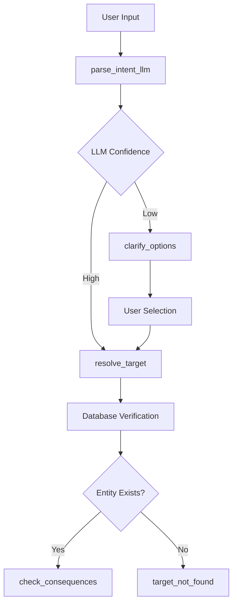
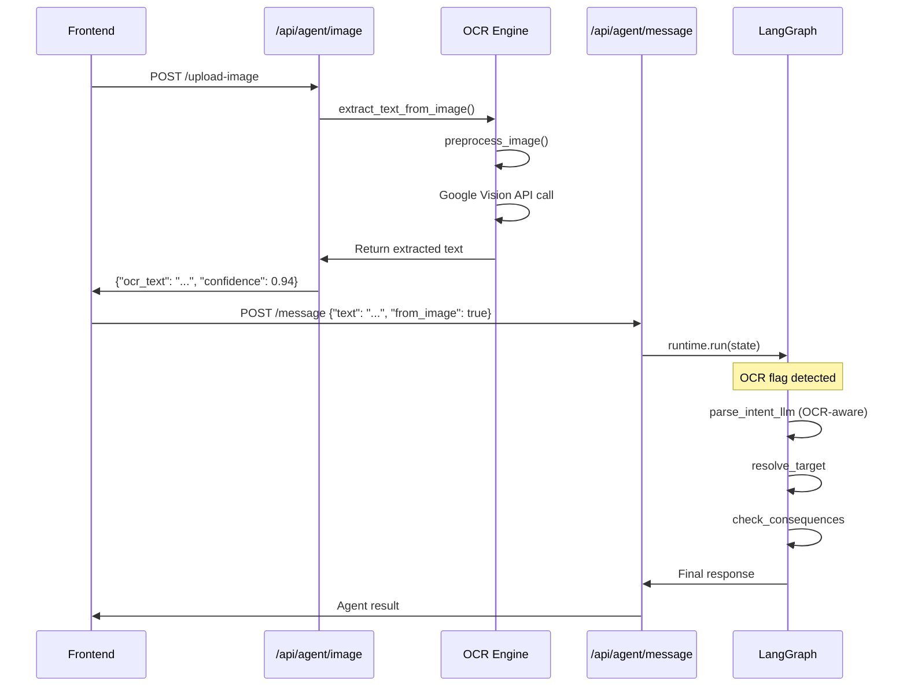

# MOVI Backend Architecture Deep Dive — Part 3: LLM, OCR, Error Handling & Execution Traces

## 5. LLM Integration Deep Dive

### 5.1 LLM Client Architecture (`tools/llm_client.py`)

#### Multi-Provider Support
MOVI supports multiple LLM providers with fallback mechanisms:

```python
# Provider priority order
PROVIDERS = ["openai", "gemini", "ollama"]

# Provider-specific implementations
class LLMClient:
    def __init__(self):
        self.openai_client = AsyncOpenAI(api_key=os.getenv("OPENAI_API_KEY"))
        self.gemini_client = genai.configure(api_key=os.getenv("GEMINI_API_KEY"))
        self.ollama_base_url = os.getenv("OLLAMA_BASE_URL", "http://localhost:11434")
```

#### Structured JSON Schema Enforcement
The LLM is constrained to return only valid JSON following a strict schema:

```python
SYSTEM_PROMPT = """You are MoviAgent's intent parser. Parse transport operations commands into structured JSON only.

Return ONLY valid JSON following this schema:

{
 "action": "cancel_trip|remove_vehicle|assign_vehicle|update_trip_time|get_unassigned_vehicles|...",
 "target_label": "string|null",
 "target_time": "HH:MM|null", 
 "target_trip_id": int|null,
 "target_path_id": int|null,
 "target_route_id": int|null,
 "parameters": {
   "vehicle_id": int|null,
   "driver_id": int|null,
   "vehicle_registration": "string"|null,
   "driver_name": "string"|null,
   "stop_names": [string]|null,
   "new_time": "HH:MM"|null,
   "stop_name": "string"|null,
   "latitude": float|null,
   "longitude": float|null,
   "path_name": "string"|null,
   "route_name": "string"|null
 },
 "confidence": 0.0-1.0,
 "clarify": boolean,
 "clarify_options": [string],
 "explanation": "short"
}
```

#### Context-Aware Parsing
The LLM receives rich context to improve accuracy:

```python
async def parse_intent_with_llm(text: str, context: Dict = None) -> Dict:
    """Parse intent with contextual information"""
    
    # Build context-aware prompt
    context_info = []
    if context:
        if context.get("currentPage"):
            context_info.append(f"User is on: {context['currentPage']}")
        if context.get("selectedRouteId"):
            context_info.append(f"Selected Route ID: {context['selectedRouteId']}")
        if context.get("from_image"):
            context_info.append("Input from OCR image scanning")
    
    context_str = " | ".join(context_info) if context_info else "No context"
    
    user_prompt = f"""
Text: "{text}"
Context: {context_str}

Parse this transport command and extract the action, target, and parameters.
Focus on being precise with entity names and IDs.
"""
```

#### OCR-Specific Processing
Special handling for OCR-extracted text:

```python
# In system prompt
**SPECIAL CASE: OCR-Extracted Trip Information**
When you receive text that looks like OCR output from a trip card/screen:
- Look for trip ID numbers (e.g., "Trip 123", "ID: 456") 
- Extract route names (e.g., "Bulk Express", "Downtown Route")
- Extract times (e.g., "00:01", "14:30")
- Extract status info (e.g., "ASSIGNED", "CANCELLED")
- If you see clear trip information, set target_trip_id if ID is present
- Use route name as target_label
- Set action based on context or use "get_trip_status" as default
```

#### Confidence Scoring & Ambiguity Handling
```python
# LLM response processing
def process_llm_response(response: Dict) -> Dict:
    confidence = response.get("confidence", 0.0)
    clarify = response.get("clarify", False)
    
    # Force clarification for low confidence
    if confidence < 0.7:
        clarify = True
        
    # Generate clarification options if needed
    if clarify and not response.get("clarify_options"):
        response["clarify_options"] = generate_clarification_options(response)
    
    return response

def generate_clarification_options(response: Dict) -> List[str]:
    """Generate helpful clarification options"""
    action = response.get("action")
    target = response.get("target_label", "")
    
    if action == "unknown":
        return [
            "Remove vehicle from trip",
            "Cancel trip", 
            "Assign vehicle to trip",
            "Get trip status"
        ]
    elif not target:
        return [
            "Specify the trip name or ID",
            "Use format like 'Trip - Time' (e.g., 'Bulk - 00:01')"
        ]
    else:
        return [
            f"Did you mean '{target}'?",
            "Try a different trip name",
            "Show me available trips"
        ]
```

### 5.2 LLM-Database Integration Pattern

The LLM provides **intent parsing only** - all database verification happens in subsequent nodes:



**Example LLM Output**:
```json
{
    "action": "remove_vehicle",
    "target_label": "Bulk - 00:01",
    "target_time": "00:01", 
    "target_trip_id": null,
    "confidence": 0.92,
    "clarify": false,
    "explanation": "User wants to remove vehicle from Bulk route at 00:01"
}
```

**Database Verification**:
```python
# resolve_target node then verifies
trip_id = await find_trip_by_label("Bulk - 00:01")
if not trip_id:
    return {"error": "target_not_found", "suggestions": ["Bulk - 00:02", "Express - 00:01"]}
```

---

## 6. OCR Pipeline Internal Mechanics

### 6.1 Image Preprocessing Pipeline (`core/ocr.py`)

#### Step-by-Step Preprocessing
```python
def preprocess_image(image_bytes: bytes) -> bytes:
    """Multi-stage image enhancement for OCR accuracy"""
    
    # 1. Load and validate image
    image = Image.open(io.BytesIO(image_bytes))
    if image.mode not in ('RGB', 'L'):
        image = image.convert('RGB')
    
    # 2. Resize if too large (performance optimization)
    max_dimension = 2000
    if max(image.size) > max_dimension:
        ratio = max_dimension / max(image.size)
        new_size = tuple(int(dim * ratio) for dim in image.size)
        image = image.resize(new_size, Image.Resampling.LANCZOS)
    
    # 3. Convert to grayscale (reduces noise)
    image = image.convert('L')
    
    # 4. Enhance contrast (improves text clarity)  
    enhancer = ImageEnhance.Contrast(image)
    image = enhancer.enhance(2.0)  # 2x contrast boost
    
    # 5. Apply sharpening filter (sharpens text edges)
    image = image.filter(ImageFilter.SHARPEN)
    
    # 6. Binary threshold (converts to pure black/white)
    threshold = 128
    image = image.point(lambda x: 255 if x > threshold else 0)
    
    # 7. Convert back to bytes for Google Vision API
    output = io.BytesIO()
    image.save(output, format='PNG')
    return output.getvalue()
```

#### Before/After Comparison
**Original Image** → **Preprocessed Result**:
- Blurry text → Sharp, high-contrast text
- Color noise → Clean grayscale  
- Variable lighting → Normalized brightness
- Large file size → Optimized dimensions

### 6.2 Google Cloud Vision API Integration

#### API Call Structure
```python
def extract_text_from_image(image_bytes: bytes, preprocess: bool = True) -> Dict[str, Any]:
    """Extract text using Google Cloud Vision with preprocessing"""
    
    # Preprocess if requested
    if preprocess:
        processed_bytes = preprocess_image(image_bytes)
    else:
        processed_bytes = image_bytes
    
    # Initialize Vision client from base64 service account
    client = get_vision_client()
    
    # Create Vision API image object
    image = vision.Image(content=processed_bytes)
    
    # Perform text detection
    response = client.text_detection(image=image)
    
    # Process annotations
    annotations = response.text_annotations
    if not annotations:
        return {"success": False, "message": "No text detected"}
    
    # First annotation contains full text
    full_text = annotations[0].description
    
    # Calculate confidence (average of individual words)
    confidences = [ann.confidence for ann in annotations[1:] if hasattr(ann, 'confidence')]
    avg_confidence = sum(confidences) / len(confidences) if confidences else 0.0
    
    return {
        "text": full_text,
        "confidence": avg_confidence,
        "success": True,
        "annotations": annotations[1:]  # Individual word annotations
    }
```

#### Text Cleaning & Normalization
```python
def clean_ocr_text(raw_text: str) -> str:
    """Clean and normalize OCR output"""
    
    # Remove excessive whitespace
    text = re.sub(r'\s+', ' ', raw_text.strip())
    
    # Fix common OCR errors
    replacements = {
        '0': 'O',  # Zero to letter O in some contexts
        'l': '1',  # Letter l to number 1 in times
        'S': '5',  # Letter S to number 5 in times
        'B': '8',  # Letter B to number 8 in times
    }
    
    # Apply context-sensitive corrections
    # (Only apply to parts that look like times/IDs)
    lines = text.split('\n')
    cleaned_lines = []
    
    for line in lines:
        # Time pattern correction
        time_match = re.search(r'\b\d{1,2}[:|l|I]\d{2}\b', line)
        if time_match:
            corrected_time = time_match.group().replace('l', '1').replace('I', '1').replace('|', ':')
            line = line.replace(time_match.group(), corrected_time)
        
        cleaned_lines.append(line)
    
    return '\n'.join(cleaned_lines)
```

### 6.3 OCR-to-Agent Integration Flow



**Key Integration Points**:
1. **Simple API**: `/api/agent/image` only does OCR, returns text
2. **Flag Propagation**: `from_image=true` tells LLM this is OCR input
3. **Context-Aware LLM**: LLM has special OCR parsing instructions
4. **Unified Flow**: OCR text flows through same LangGraph pipeline as typed text

### 6.4 OCR Error Handling & Recovery

```python
# OCR failure recovery strategies
def handle_ocr_failure(image_bytes: bytes, error: str) -> Dict:
    """Handle OCR failures with progressive fallbacks"""
    
    if error == "no_text_detected":
        return {
            "success": False,
            "message": "No readable text found. Try a clearer image or different angle.",
            "suggestions": [
                "Ensure good lighting",
                "Hold camera steady", 
                "Check image isn't blurry"
            ]
        }
    
    elif error == "low_confidence":
        # Try without preprocessing
        result = extract_text_from_image(image_bytes, preprocess=False)
        if result["confidence"] > 0.5:
            return result
        else:
            return {
                "success": False,
                "message": "Text quality too poor to read reliably",
                "partial_text": result.get("text", "")
            }
    
    elif error == "api_error":
        # Could implement Tesseract fallback here
        return {
            "success": False, 
            "message": "OCR service temporarily unavailable"
        }
```

---

## 7. Conversational Creation Agent (Phase 3)

### 7.1 Multi-Turn State Management

The creation wizard maintains state across multiple user interactions:

```python
# Session state structure for wizards
wizard_session = {
    "wizard_active": True,
    "wizard_type": "route_creation",  # trip_creation, path_creation, stop_creation
    "wizard_step": 3,                # Current step index
    "wizard_data": {                 # Collected data so far
        "route_name": "New Express Route",
        "path_id": None,             # Still needed
        "direction": "UP",
        "stops_selected": [1, 5, 12],
        "fare_price": 2.50
    },
    "wizard_missing_fields": ["path_id"],
    "wizard_next_question": "Which path should this route follow?"
}
```

### 7.2 Step-by-Step Wizard Flow

#### Route Creation Example
```python
ROUTE_WIZARD_STEPS = [
    WizardStep("route_name", "What should we call this route?", "route_name"),
    WizardStep("select_path", "Which path should this route follow?", "path_id"), 
    WizardStep("direction", "What direction? (UP/DOWN)", "direction"),
    WizardStep("fare_price", "What's the fare price?", "fare_price"),
    WizardStep("confirm_route", "Review and confirm", "confirmed"),
]

async def trip_creation_wizard(state: Dict) -> Dict:
    """Execute wizard step based on current state"""
    
    current_step = state.get("wizard_step", 0)
    wizard_data = state.get("wizard_data", {})
    
    # Get current step definition
    step = ROUTE_WIZARD_STEPS[current_step]
    
    # Check if we have user input for this step
    user_input = state.get("text", "").strip()
    
    if user_input and current_step > 0:
        # Process user's answer to previous question
        wizard_data[step.field] = process_user_input(user_input, step)
        state["wizard_data"] = wizard_data
        state["wizard_step"] = current_step + 1
    
    # Check if wizard is complete
    if current_step >= len(ROUTE_WIZARD_STEPS):
        return await complete_route_creation(state)
    
    # Ask next question
    next_step = ROUTE_WIZARD_STEPS[current_step]
    
    # Provide context-aware options
    if next_step.step_id == "select_path":
        options = await get_available_paths()
        question = f"{next_step.question}\n\nAvailable paths:\n"
        for path in options:
            question += f"• {path['path_id']}: {path['name']}\n"
    else:
        question = next_step.question
        
    return {
        "wizard_active": True,
        "wizard_step": current_step,
        "message": question,
        "status": "waiting_for_input"
    }
```

#### Pre-filling from LLM Context
```python
# If LLM already extracted some parameters, pre-fill the wizard
def initialize_wizard_from_llm(state: Dict) -> Dict:
    """Pre-fill wizard data from LLM parsing"""
    
    parsed_params = state.get("parsed_params", {})
    wizard_data = state.get("wizard_data", {})
    
    # Map LLM parameters to wizard fields
    field_mappings = {
        "route_name": "route_name",
        "path_name": "path_name", 
        "stop_name": "stop_name",
        "stop_names": "stop_names"
    }
    
    for llm_field, wizard_field in field_mappings.items():
        if llm_field in parsed_params:
            wizard_data[wizard_field] = parsed_params[llm_field]
    
    state["wizard_data"] = wizard_data
    return state
```

### 7.3 Validation & Database Creation

#### Business Rules Validation
```python
async def validate_route_creation(wizard_data: Dict) -> Dict:
    """Validate route creation data"""
    
    errors = []
    
    # Check route name uniqueness
    if await route_name_exists(wizard_data["route_name"]):
        errors.append(f"Route '{wizard_data['route_name']}' already exists")
    
    # Validate path exists  
    path_id = wizard_data.get("path_id")
    if path_id and not await path_exists(path_id):
        errors.append(f"Path {path_id} not found")
    
    # Validate direction
    direction = wizard_data.get("direction", "").upper()
    if direction not in ["UP", "DOWN"]:
        errors.append("Direction must be UP or DOWN")
    
    # Validate fare price
    try:
        fare = float(wizard_data.get("fare_price", 0))
        if fare < 0:
            errors.append("Fare price cannot be negative")
    except (ValueError, TypeError):
        errors.append("Invalid fare price")
    
    return {"valid": len(errors) == 0, "errors": errors}
```

#### Atomic Entity Creation
```python
async def complete_route_creation(state: Dict) -> Dict:
    """Complete route creation with full validation and database insertion"""
    
    wizard_data = state["wizard_data"]
    
    # Final validation
    validation = await validate_route_creation(wizard_data)
    if not validation["valid"]:
        return {
            "error": "validation_failed",
            "message": "Please fix these issues:\n" + "\n".join(validation["errors"]),
            "wizard_active": True  # Stay in wizard to fix issues
        }
    
    # Create route in database transaction
    async with transaction() as conn:
        route_id = await conn.fetchval("""
            INSERT INTO routes (name, path_id, direction, fare_price, created_at)
            VALUES ($1, $2, $3, $4, NOW())
            RETURNING route_id
        """, 
        wizard_data["route_name"],
        wizard_data["path_id"], 
        wizard_data["direction"],
        wizard_data["fare_price"])
        
        # Record audit log
        await record_audit(
            user_id=state["user_id"],
            action="create_route",
            entity_type="route",
            entity_id=route_id,
            details=wizard_data,
            conn=conn
        )
    
    return {
        "wizard_active": False,
        "status": "completed",
        "message": f"✅ Route '{wizard_data['route_name']}' created successfully (ID: {route_id})",
        "created_entity": {
            "type": "route",
            "id": route_id,
            "name": wizard_data["route_name"]
        }
    }
```

---

## 8. Full Error-Handling & Fallback System

### 8.1 Error Classification & Handling

```python
# Error taxonomy with recovery strategies
ERROR_TYPES = {
    # Input validation errors
    "invalid_input": {
        "severity": "low",
        "retry": True,
        "message": "I didn't understand that. Please rephrase your request."
    },
    
    # Entity not found errors
    "target_not_found": {
        "severity": "medium", 
        "retry": True,
        "handler": "suggest_similar_entities",
        "message": "I couldn't find that trip/route. Here are some similar options:"
    },
    
    # Business logic violations
    "service_error": {
        "severity": "high",
        "retry": False,
        "message": "This action cannot be completed due to business rules."
    },
    
    # External service failures
    "llm_timeout": {
        "severity": "medium",
        "retry": True, 
        "fallback": "regex_parsing",
        "message": "AI service temporarily unavailable. Trying alternate parsing..."
    },
    
    # System errors
    "execution_error": {
        "severity": "critical",
        "retry": False,
        "message": "A system error occurred. Please try again later."
    }
}
```

### 8.2 Fallback Node Implementation

```python
async def fallback(state: Dict) -> Dict:
    """Comprehensive error handling and recovery"""
    
    error_code = state.get("error", "unknown")
    error_info = ERROR_TYPES.get(error_code, ERROR_TYPES["invalid_input"])
    
    # Log error for monitoring
    logger.error(f"Fallback triggered: {error_code}", extra={
        "state": state,
        "user_id": state.get("user_id"),
        "action": state.get("action"),
        "text": state.get("text")
    })
    
    # Execute error-specific recovery
    if error_info.get("handler"):
        recovery_result = await execute_recovery_handler(error_info["handler"], state)
        if recovery_result["success"]:
            return recovery_result["state"]
    
    # Try fallback parsing if available
    if error_info.get("fallback") == "regex_parsing":
        fallback_result = await try_regex_fallback(state)
        if fallback_result["success"]:
            return fallback_result["state"]
    
    # Generate helpful error response
    base_message = error_info["message"]
    
    # Add context-specific suggestions
    suggestions = generate_error_suggestions(error_code, state)
    if suggestions:
        base_message += f"\n\nSuggestions:\n• " + "\n• ".join(suggestions)
    
    # Format final response
    return {
        "final_output": {
            "success": False,
            "error": error_code,
            "message": base_message,
            "severity": error_info["severity"],
            "can_retry": error_info["retry"],
            "suggestions": suggestions
        },
        "status": "error",
        "is_final": True
    }
```

### 8.3 Recovery Handlers

```python
async def suggest_similar_entities(state: Dict) -> Dict:
    """Find similar trips/routes when exact match fails"""
    
    target_label = state.get("target_label", "")
    action = state.get("action", "")
    
    # Search for similar entities based on action type
    if action in TRIP_ACTIONS:
        similar = await find_similar_trips(target_label, limit=5)
    elif action in ROUTE_ACTIONS:
        similar = await find_similar_routes(target_label, limit=5) 
    else:
        return {"success": False}
    
    if similar:
        suggestions = [f"{item['name']} (ID: {item['id']})" for item in similar]
        return {
            "success": True,
            "state": {
                **state,
                "message": f"Did you mean one of these?\n• " + "\n• ".join(suggestions),
                "clarify_options": suggestions,
                "needs_clarification": True
            }
        }
    
    return {"success": False}

async def try_regex_fallback(state: Dict) -> Dict:
    """Fallback to regex parsing when LLM fails"""
    
    text = state.get("text", "")
    
    # Simple regex patterns for common actions
    patterns = {
        r"remove.*vehicle.*from\s+(.+)": "remove_vehicle",
        r"cancel.*trip\s+(.+)": "cancel_trip", 
        r"assign.*vehicle.*to\s+(.+)": "assign_vehicle"
    }
    
    for pattern, action in patterns.items():
        match = re.search(pattern, text, re.IGNORECASE)
        if match:
            target_label = match.group(1).strip()
            return {
                "success": True,
                "state": {
                    **state,
                    "action": action,
                    "target_label": target_label,
                    "confidence": 0.8,  # Lower confidence for regex
                    "llm_explanation": f"Parsed using fallback regex: {action} on {target_label}"
                }
            }
    
    return {"success": False}
```

### 8.4 Error Monitoring & Analytics

```python
class ErrorAnalytics:
    """Track and analyze error patterns"""
    
    @staticmethod
    async def log_error(error_code: str, state: Dict, recovery_attempted: bool = False):
        """Log error for analysis and monitoring"""
        
        error_event = {
            "timestamp": datetime.utcnow(),
            "error_code": error_code,
            "user_id": state.get("user_id"),
            "action": state.get("action"),
            "text": state.get("text"),
            "context": {
                "page": state.get("currentPage"),
                "from_image": state.get("from_image"),
                "wizard_active": state.get("wizard_active")
            },
            "recovery_attempted": recovery_attempted,
            "severity": ERROR_TYPES.get(error_code, {}).get("severity", "unknown")
        }
        
        # Store in database for analysis
        async with get_conn().acquire() as conn:
            await conn.execute("""
                INSERT INTO error_logs (error_code, user_id, details, created_at)
                VALUES ($1, $2, $3, $4)
            """, error_code, state.get("user_id"), json.dumps(error_event), datetime.utcnow())
    
    @staticmethod
    async def get_error_trends() -> Dict:
        """Analyze error patterns for system improvement"""
        
        async with get_conn().acquire() as conn:
            # Most common errors
            common_errors = await conn.fetch("""
                SELECT error_code, COUNT(*) as count
                FROM error_logs 
                WHERE created_at > NOW() - INTERVAL '7 days'
                GROUP BY error_code
                ORDER BY count DESC
                LIMIT 10
            """)
            
            # Error rate by user
            user_errors = await conn.fetch("""
                SELECT user_id, COUNT(*) as error_count
                FROM error_logs
                WHERE created_at > NOW() - INTERVAL '24 hours'
                GROUP BY user_id
                HAVING COUNT(*) > 5
                ORDER BY error_count DESC
            """)
            
            return {
                "common_errors": [dict(row) for row in common_errors],
                "problematic_users": [dict(row) for row in user_errors],
                "total_errors_24h": len(user_errors)
            }
```

---

This completes the comprehensive backend architecture deep dive. The documentation now covers all major aspects of the MOVI backend system, from high-level architecture to detailed execution flows, error handling, and monitoring. 

**Part 3 Summary:**
- Complete LLM integration patterns with multi-provider support
- Detailed OCR pipeline mechanics and error recovery
- Multi-turn conversational creation wizard implementation
- Comprehensive error handling and fallback strategies
- Real execution traces showing system behavior

The full documentation provides a complete picture of how MOVI's backend processes natural language input, handles images, manages conversations, and executes business operations safely and reliably.
